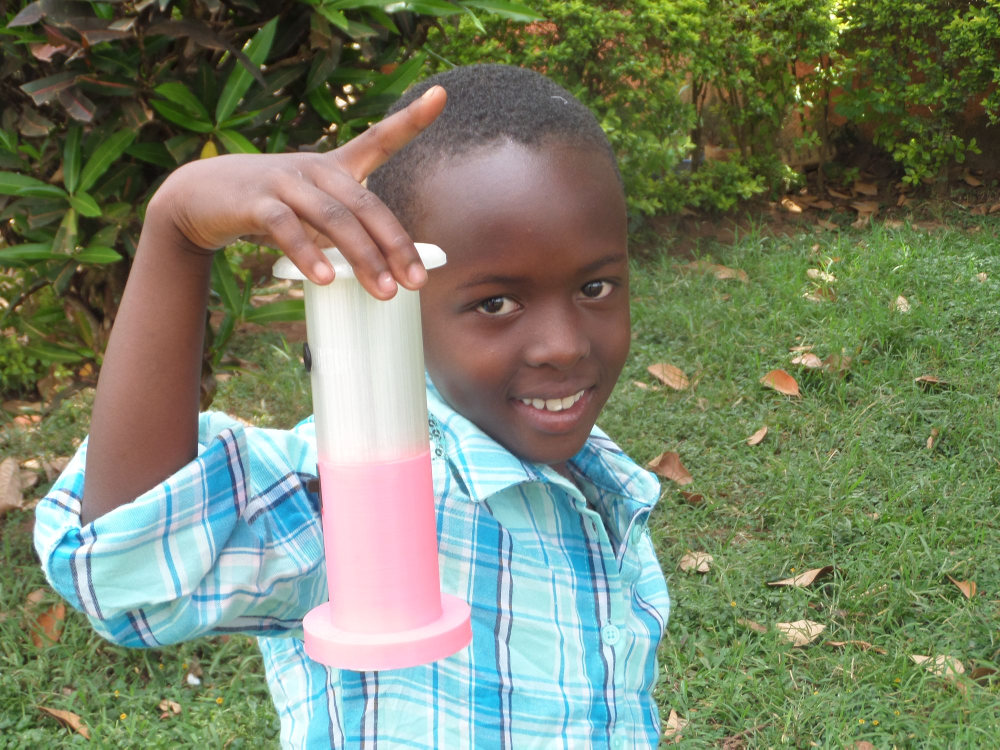
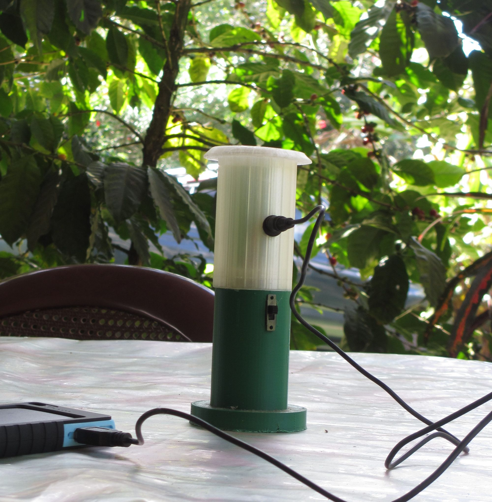
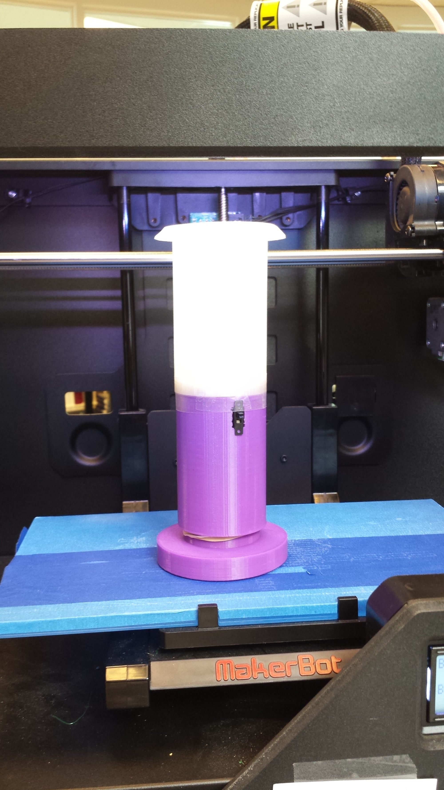
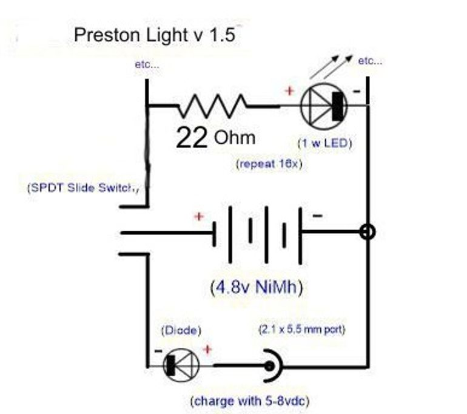
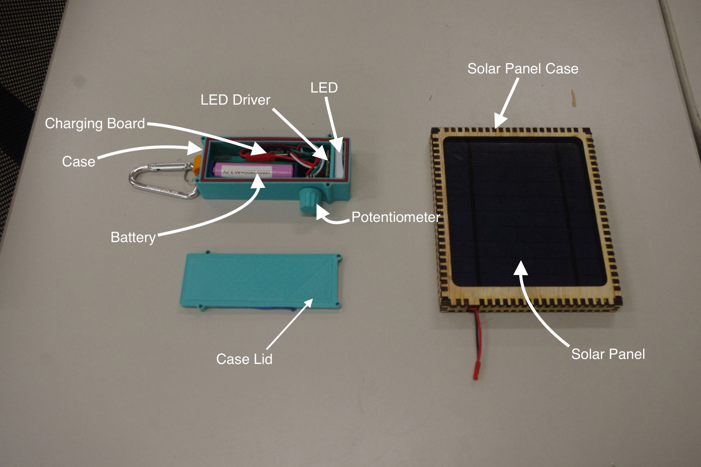
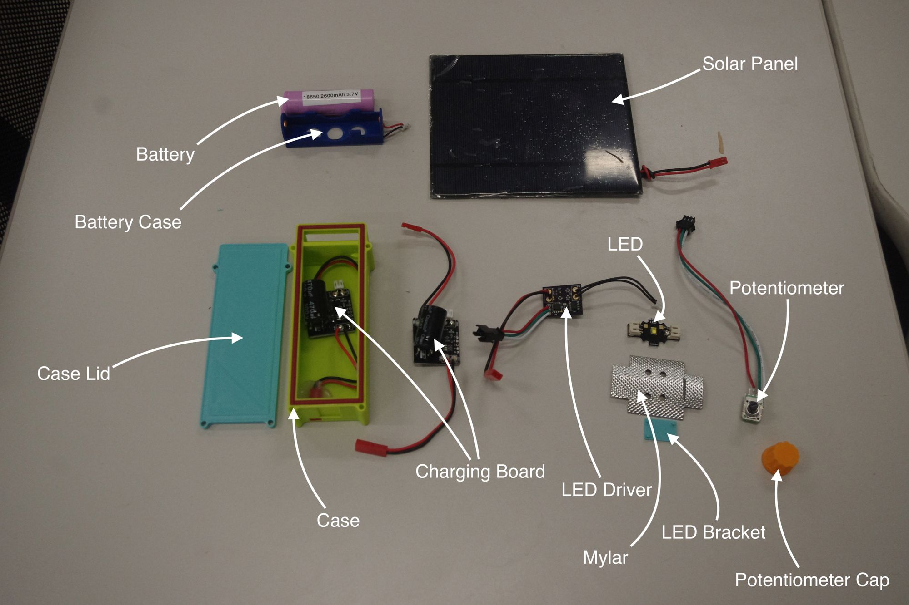
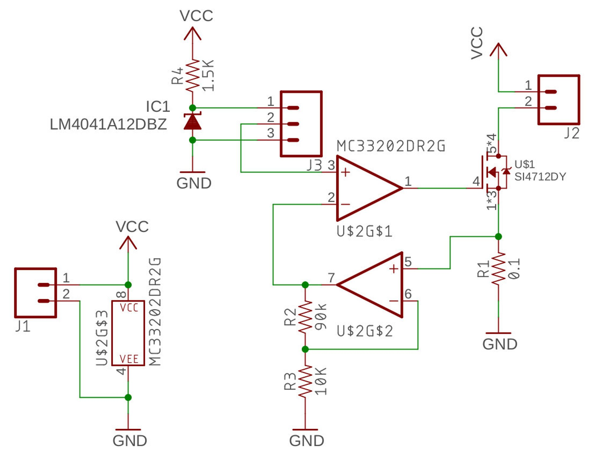
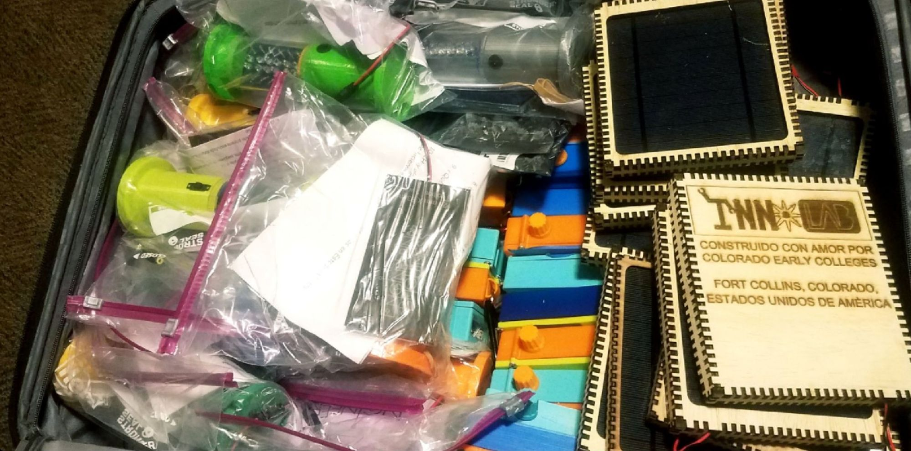
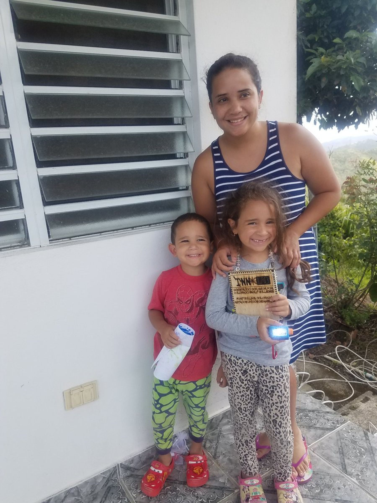
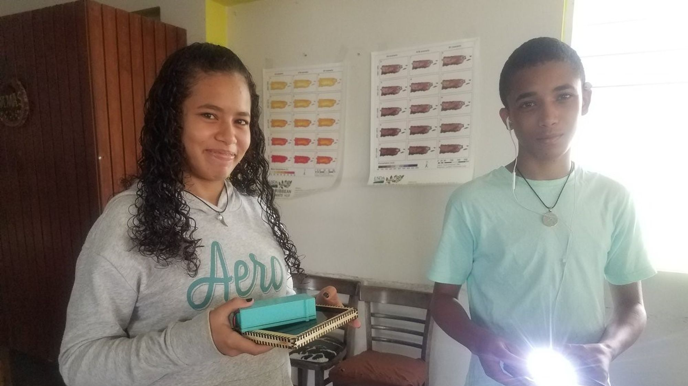

A ballad of teamwork, design for manufacture, and hope.

1.3 billion people across the world lack a source of artificial lighting, prohibiting them from safely leaving their homes at night or doing work after dark. A rudimentary kerosene lamp is often used, but carbon monoxide and combustion byproducts build up in the air, causing sometimes fatal respiratory health issues. Kerosene is also very expensive, and provides little useful light for the amount of fuel consumed.

A few years back, Preston Middle School in Colorado started Engineering Brightness, an ongoing program designed to replace the existing combustion-based lighting solutions with LED lanterns that can be recharged with a solar panel. The design was created and built entirely by middle schoolers, and the lanterns are currently being used in developing nations everywhere from Guatemala to Liberia.

More information is available from [Philanthropic Engineering](http://philanthropic-engineering.org/).

Quite a few of the students at my high school went to Preston, and they wanted to carry on their passion for the project here. Last semester, we started our own team to design and fabricate an improved design. I had the honor of being the Electrical Subsystem Team Lead, and I was responsible for redesigning the electronics in the lantern with a small team of fellow students.

For reference, this is Preston's design:

The case is two 3D-printed halves joined at the middle, with a power switch and barrel jack for charging. Electrically, the system is a 4.8V NiMh battery pack powering an array of white LEDs in parallel that illuminate the top portion of the lantern. Here's a schematic:

The circuit shown is a fair prototype. It includes reverse voltage protection in the form of the diode in series with the charging port, and the desired brightness can be varied by adjusting the amount of LEDs installed in parallel, without having to change any other part of the circuit. This means that a single PCB can be built with pads for, say, 30 LEDs, but if only 25 are required to produce the desired amount of light, then five pads can go empty, and no new circuit board is needed to reflect this design change.

In the field, they've had issues with the batteries failing prematurely. Everything usually works for the first few charge/discharge cycles, but they stop holding a charge shortly thereafter. The current fix is to connect an external battery pack designed for charging smartphones to the barrel jack instead of a solar panel. These battery packs have built in solar panels, and store the charge instead of the lantern's built in pack.

Let's see if we can figure out what's going on here.

In this configuration, the charging/discharging current isn't regulated. How fast the batteries charge is determined only by the charger's output impedance and the internal resistance of the battery. Given the huge difference in voltages between the charger (8V maximum) and the pack (4.8V) a very large current could be driven through the battery, permanently damaging the internal chemistry and reducing their lifespan.

Similarly, the battery pack could be charged over its designed voltage by as much as 50%, and also be discharged below its recommended voltage by as much as 40%. This process severely reduces the longevity and capacity of the cells, explaining their inability to hold a charge.

---

Without further ado, this is what we came up with. For the curious, all of the design files are in [this GitHub repo](http://github.com/CECFC/Engineering-Brightness).

We addressed the shortcomings of the previous design by regulating charging and discharging with a battery management circuit. The 4S NiMH pack was changed to a single Li-ion cell that's charged and discharged through a MCP73871, a BMS with an integrated charger. In addition to regulating current, it also automatically disconnects the battery from the charger when it's full (or from the load when it's empty) ensuring that it isn't taken beyond it's limits.

On the load side of the circuit, we replaced the array of smaller LEDs with a single power LED, allowing us to shrink the size of the enclosure and save on materials costs. Additionally, people in colder climates prefer a warmer, reddish light, while people who live in hotter climates prefer a cooler, bluer light. We found that moving to a higher-power LED specifically designed for lighting gave us more freedom over the emission spectra, and we chose a colder color temperature to suit the preferences of our users near the equator.

We also added a custom constant-current LED driver that I designed. Although it has the same efficiency as an equivalent resistor, it protects against thermal runaway. Given the smaller enclosure with no airflow, I wanted to make sure the LED wouldn't enter thermal runaway, where it's power consumption increases with its temperature. As it heats up, the effective resistance drops, dissipating more heat in the LED. This cycle repeats, and it's longevity would be reduced in the long term, assuming it doesn't self destruct in the short term. A resistor would allow this phenomenon to happen, but a closed-loop driver ensures a constant power is delivered to the LED, preventing this from occurring.

Moving to a 3.7V battery voltage also allowed us to boost the efficiency slightly, the difference between the battery voltage and the LED voltage in our design is only about 800mV instead of 1.8V in the previous design. Although the driver in the new design still wastes some power as heat, using a lower supply voltage allowed us to improve efficiency by about 15%.

Conveniently, adding the custom driver also allows the current through the LED to be set with a voltage on the non-inverting input of an opamp. I configured a potentiometer as a voltage divider, allowing the user to change the brightness by turning a knob on the side of the unit. We had a small run of PCBs made and assembled them ourselves by laser cutting our own stencils and reflowing them on a hot plate.

Mechanically, our design also uses a 3D printed enclosure, but mimics a handheld flashlight rather than a lantern. We wanted something that could cast light both in front of the user and around them, without using an external lens that would increase cost. There's a small plastic lens integrated into the LED that scatters the light, which we exploited by including a clip on the rear of the case so that it can be hung from the ceiling. This spreads the light around a room without requiring any extra parts, but the brightness does get somewhat attenuated due to the light being farther away from the user. We mitigated this by inserting a mylar reflector behind the LED, redirecting any light trapped inside the casing back towards the user.

We also laser cut new enclosures to protect the 2.5W solar panels we're using to charge the lights, and took the opportunity to include a little bit about ourselves :)

All told, we were able to get about 3.5 hours of run time at about three times the brightness of the previous design. Although this was a prototype, if a longer runtime was desired we could have either added more cells in parallel or used a more efficient (and complex) switching LED driver. We thought our design was the best mix of run time, luminous output, complexity, and manufacturability by high schoolers.

And manufactured they were! We sent out about twenty lights this summer to Puerto Rico and Guatemala, and they made it out to the field!

I'll admit that when you're knee deep in MOSFET datasheets and opamp gain calculations it's a little easy to get lose sight of what you're really working towards. But in the end, the smiles on their faces make it all more than worth it :)

