You see, I’ve got a little bit of a problem. My mentor is a professional metrologist whose career revolves around measuring things very, very accurately. In my years of working with him, I seem to have been bitten by this bug somewhat in machining (I have to use micrometers, can’t use calipers) but moreso in electronics. Perhaps that’s due to the fact that electron motion is invisible, giving the properties I’m measuring a mysterious characteristic, or that there’s more to measure than a dimension or an angle. Either way, in October 2016 I set out to build a self-calibrating frequency standard to measure time very accurately, to within a part per billion.

Before I dive in, here are some pictures of the final product and the stages of its development:
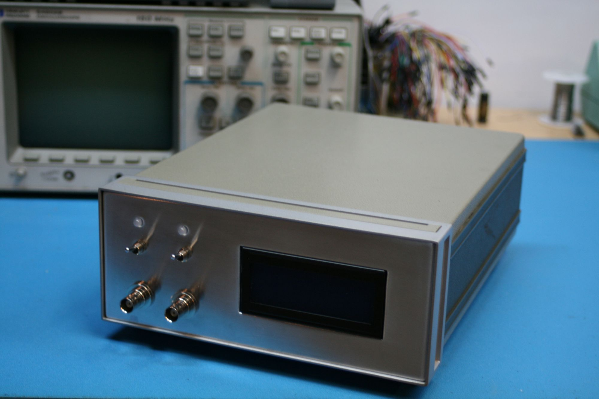
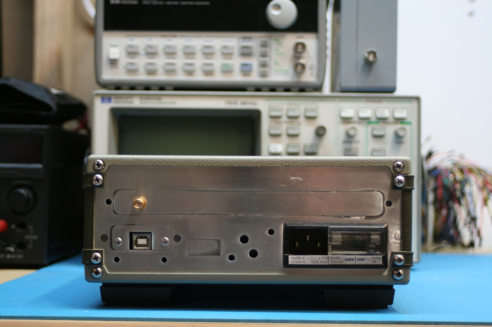
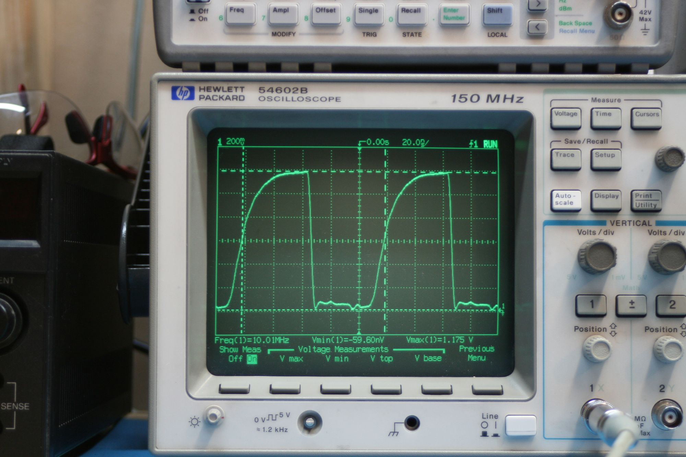
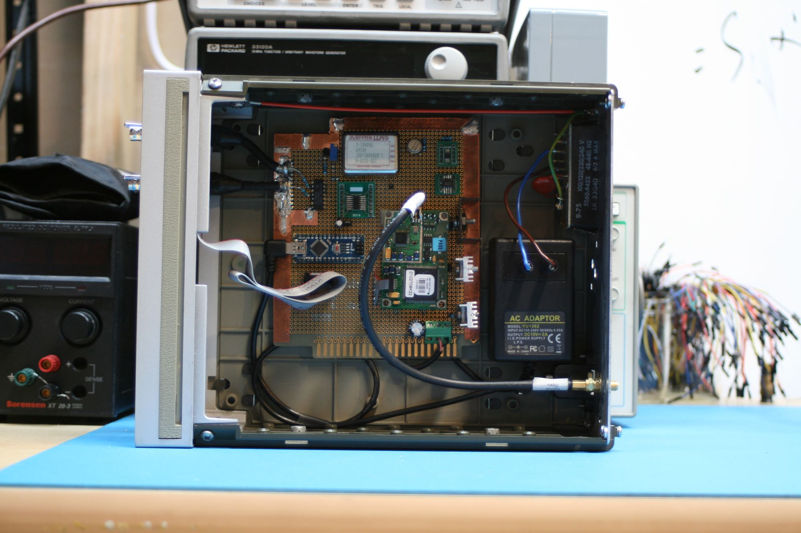
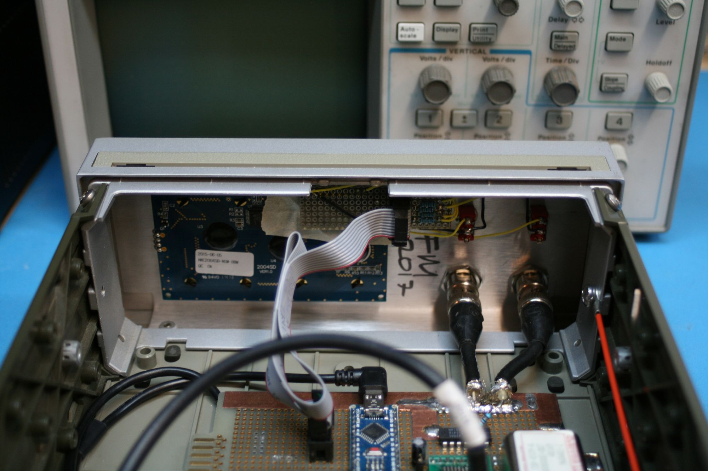
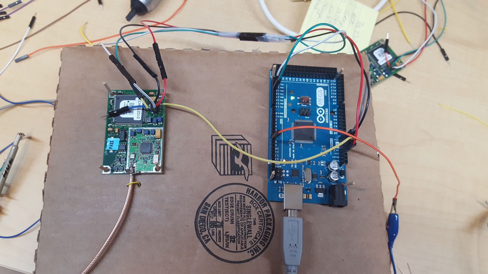
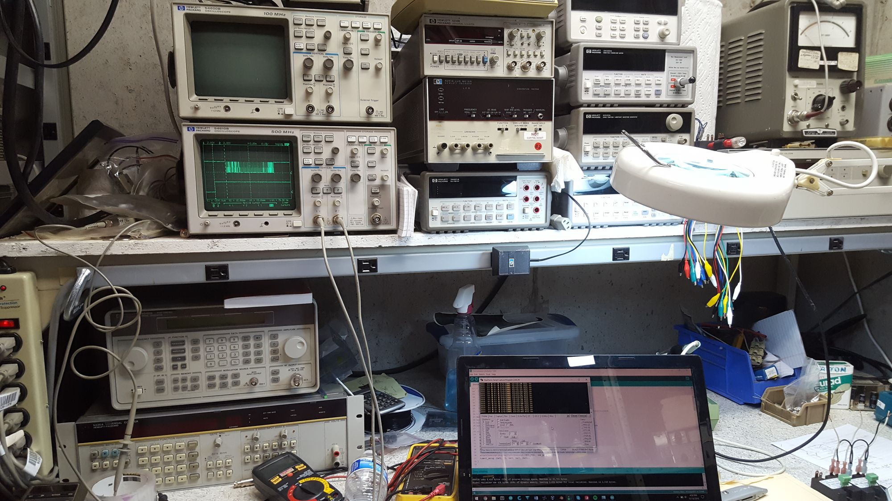
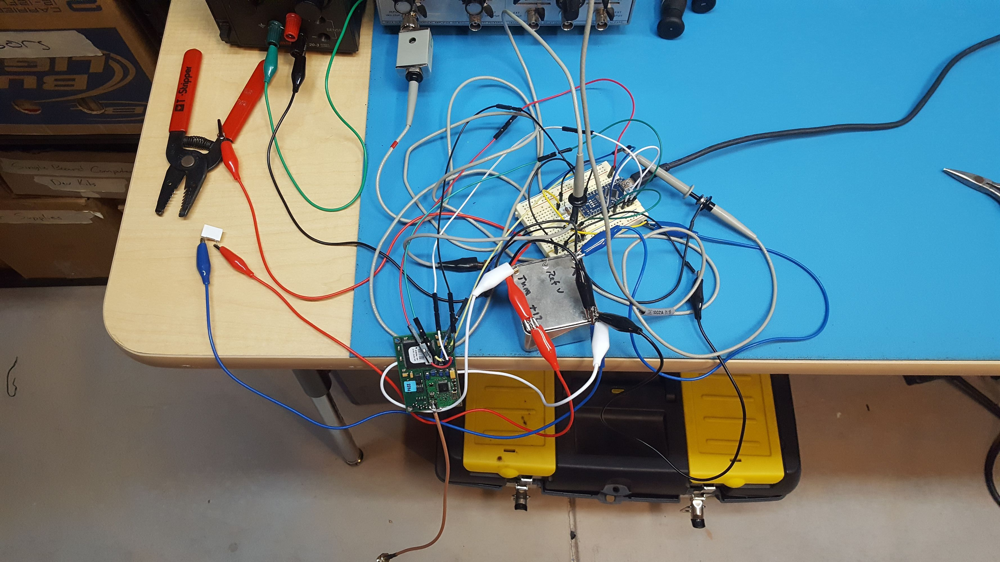
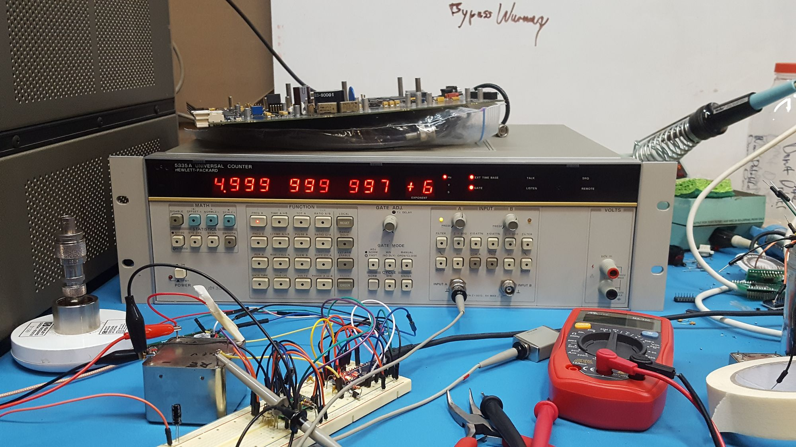
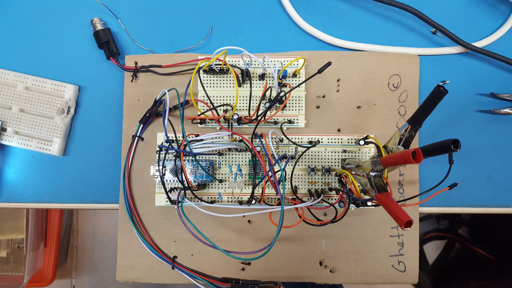

In electronics, we can measure a few concrete, basic properties of a system: Voltage, Current, Resistance, and Time. Given that I’ve got a HP 34401 6.5 digit multimeter, I’ve got the first three covered. But other than the uncalibrated crystal oscillator inside a 5315 counter, I don’t have an accurate time reference.

Stating that one desires to measure time is about as specific as saying that one wants to measure electricity, so for more clarification, I want to measure frequency, period, and time intervals. The 5315 can perform these measurements, but with little accuracy. It contains a crystal oscillator, but I don’t know the last time it was calibrated, and it was off by about 100 parts per billion at the last check.

In order to measure frequency, the counter will count how many peaks enter the instrument in the time it takes for its local oscillator (LO) to count to ten million, as the internal oscillator has a frequency of 10MHz. Period measurements are taken in a similar way, where it counts the amount of peaks of the LO in between peaks of the input signal. Time interval measurements are basically period measurements, but instead of starting and stopping LO counting on one input signal, it will start counting on one input’s peak, and stop on the other input’s peak.

Thus, all time measurements are, in essence, counting processes. This greatly simplifies the internal architecture of the counter, but the measurement accuracy is completely dependent on the accuracy of the LO. As a result, measurements from the 5315 are not terribly accurate, simply because of the LO’s inaccuracy.

What’s one to do? The LO in my counter can be adjusted, but I wouldn’t know how much to adjust it by without a more accurate time source, referred to as a frequency standard. And even with an accurate frequency standard, the LO’s frequency will drift from the ideal over time. This means that a LO calibrated with NIST’s hydrogen maser will be spot on right after calibration, but no good within a week.

This leaves us in a little bit of a pickle. If the LO can’t keep it’s calibration, how can we be expected to make an accurate measurement? The simple answer is to not use the LO at all, but bypass it and use a more accurate external frequency reference instead.

Traditional frequency references take two forms, crystal and atomic. The 5315 contains a crystal, and while they are significantly cheaper than their counterparts, they suffer from the aforementioned problem of drift. They can’t keep the same frequency over time, but the frequency is easily changed by applying small voltage to the crystal. Crystals that allow the user to change their frequency are called voltage controlled oscillators, or VCOs, and the 5315’s LO is of this type.

Atomic frequency references or atomic clocks are more expensive, but have a much lower drift rate than crystalline counterparts. Most hobbyist-accessible atomic frequency references derive their oscillation period from the hyperfine transition of rubidium. Rubidium frequency standards can be calibrated similarly to crystals, and they will keep their calibration for a long period of time due to their low drift rate. These characteristics result in a very stable, but consequently very expensive, frequency standard.

If crystal oscillators won’t cut the mustard and atomic clocks are out of reach, how can I get a precision timebase? The answer lies in (cue music) space…

Or more specifically, low Earth orbit. GPS relies on the ability to accurately measure distance between a receiver and a satellite whose position is known. If d=rt, then in order to know distance very accurately, then the speed of light and the time it took to travel from the satellite to the receiver must also be known very accurately. Thanks to some bright folks with cool lasers, we know the speed of light very well, and due to the sheer magnitude of c, time must be known very, very precisely to have any hope of knowing position.

Luckily for us, each GPS satellite carries onboard a frequency standard maintained by the United States Naval Observatory and synchronized to their master clock. A GPS module can lock onto the signals broadcast by the constellation, and extract timing information from them in the form of a One Pulse Per Second (1PPS) signal. This signal goes high at the beginning of every UTC second, and by measuring the amount of time in between the rising edge of two pulses, one second of time can be measured.

This is fantastic! A time reference with the same accuracy as the USNO’s master clock for free!

Not so fast, buster.

The problem with this approach is that Earth has an atmosphere, and the radio signal gets scattered within it on its way down, taking more (or less) time to reach the receiver than it otherwise would. This, combined with multipath propagation effects where the GPS signals from the satellites take multiple paths to the receiver, creates noise (±1μs) in the 1PPS. Thanks to the algorithms in the GPS network, over time timing is perfect, but short-term, it stinks.

So, a crystal has short-term accuracy, but lacks long-term accuracy. GPS timing doesn’t have short-term accuracy, but offers perfect long-term timekeeping. If only it was possible to combine the two for both short and long term accuracy!

Which is exactly what I’ve done. The system architechture is a frequency locked loop, where the microcontroller counts the amount of peaks output by its LO in between the rising edges of the 1PPS. If this value is higher than 10 million counts, equating to 10 MHz, then the LO is too fast. If the value is lower than 10 MHz, then the LO is too slow. Since the 1PPS signal is noisy, these measurements are noisy too. To compensate, the firmware on the microcontroller averages them for about 45 minutes, and then will generate its “best guess” of what it thinks the error is.

After this “best guess” is generated, the system will write a new value to the DAC if necessary. The DAC converts a digital value from the microcontroller into an analog value that directly controls the frequency of the oscillator. Increasing the voltage decreases the frequency, and decreasing the voltage increases the frequency. Thus, the negative feedback portion of the loop takes place within the oscillator itself, and doesn’t need to take place within software. The derivation of the new DAC value from the best guess has been the subject of the Brief Encounter with the GPIB series of log posts, and is accomplished by multiplying the best guess by a constant specified in LSB/mHz. After this new value is written, the microcontroller erases the previous set of data and begins the cycle again. Thus, the frequency of the internal crystal is “disciplined” to the GPS. Since the crystal is oven controlled, the entire system can be referred to as a GPS Disciplined Oven Controlled Crystal Oscillator, or GPSDOCXO or GPSDO for short. In a block diagram, it looks like this:

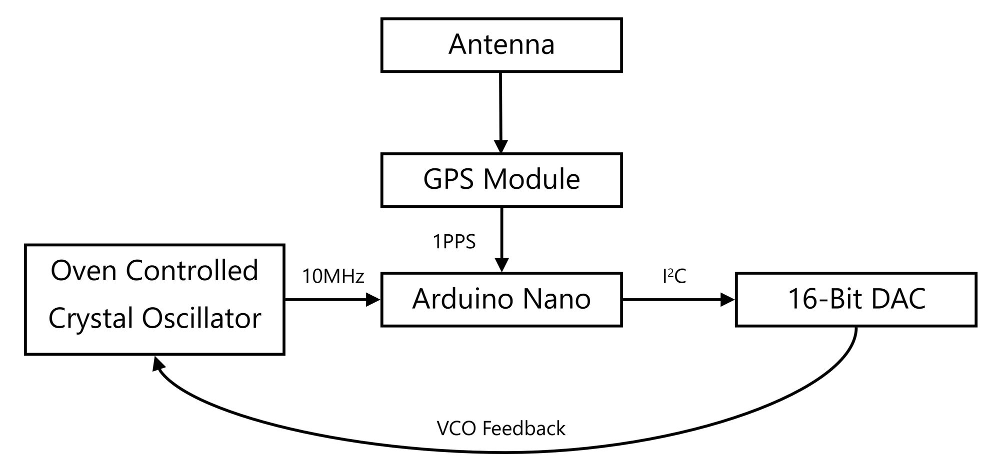

However, the above diagram is greatly simplified, and doesn’t show a few minor technical points.

The DAC’s output only goes from 0-5V, and the OCXO accepts 0-10V on its VCO input. An OP-07 precision amplifier takes care of multiplying this signal by two to maximize the tuning range of the DAC. In addition to output scaling, the DAC needs a 5V reference. I could have merely used the 5V rail, but I chose to use a 0.04% accuracy, 3ppm/°C voltage reference. This ensures that the DAC’s output voltage doesn’t vary with the load on the 5V rail. Increased load current would create a higher power dissipation in the 7805 linear regulator, and cause a temperature change, heavily affecting the high thermal coefficient voltage reference inside the 7805. I didn’t want to risk it, and the reference prevents any temperature dependent voltage changes.

The diagram also doesn’t show the front panel components, which consist of an LCD, LEDs, switches, and BNC output connectors.

Also, the microcontroller is clocked at 16 MHz, and the Nyquist sampling theorem limits the maximum frequency it can count to 8MHz. Ten doesn’t divide cleanly into eight, and while fractional frequency synthesis could have been done, it would have introduced additional jitter and further exacerbated the noise problem. However, five divides nicely into ten, and a 74HC74 flip-flop divides the signal by two before feeding it into the microcontroller.

The internal OCXO’s output is sinusoidal, with an amplitude of about ±1.5V. This presented a few problems, as the flip-flop will be destroyed if fed a negative voltage, and the output of the crystal wasn’t strong enough to directly drive it. Both problems were fixed with a NPN transistor amplifier, and the oscillator’s output is AC coupled through a capacitor to the base of the transistor, which is biased above ground with a trimpot voltage divider.

But wait! The transistor amplifier and flip-flop only drive the microcontroller, what about the outputs that would be driving my counter? I wouldn’t want to connect them to the collector of the amplifier, because if the output were to pull the voltage higher than zero and turn the GPSDO’s output into an input, the OCXO could be destroyed. I needed a multi-port buffer, so that the device could drive additional loads and protect itself simultaneously.

A 74HC7014 fit the bill nicely. It’s a hex schmitt trigger, which acts like a comparator in this application. It takes the positive sinusoidal signal from the transistor amplifier and converts it into a 0-5V signal to drive both the flip-flop and the front panel outputs. Since the signal from the transistor amplifier is still relatively weak, it passes through one trigger before driving the other trigger inputs. In this configuration, the amplifier only drives one input, instead of three inputs; two for the front panel outputs and one for the flip-flop.

All put together, the simplified block diagram becomes rather complicated, and looks like this:

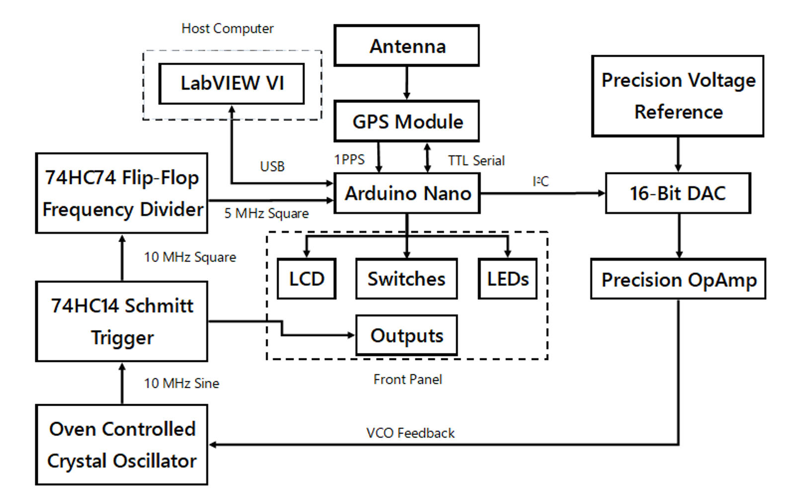

For the curious, here is the full system schematic:

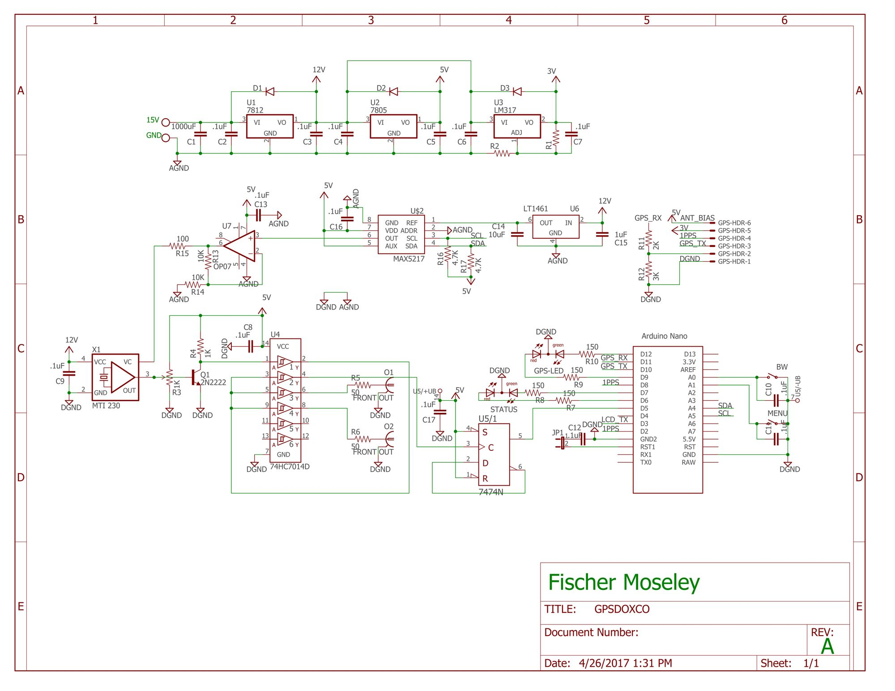

The source code is available on [GitHub](https://github.com/FischerMoseley/GPSDO).

Design architecture aside, I soldered the circuit onto a perfboard and installed it a case graciously donated by an old HP ASCII to Parallel converter. I sanded the paint off the front panel of the instrument, milled a hole for the LCD, installed the indicators and connectors, and soldered the connections to a daughterboard which hosts a ribbon cable to facilitate communication with the main board. This allows for easy disconnection from the rest of the device for ease of disassembly and troubleshooting. 3M Dual Lock was used to mechanically affix the LCD to the front panel, and the switches are bolted into the front panel, allowing for quick, complete disassembly if necessary.

I finished building the oscillator in February 2017, and finished testing in April 2017. It works quite well if I do say so myself. From the GPIB series of log posts, I know that it exceeds my original goal of 1ppb accuracy on average, and just barely comes in over on the extreme. That’s pretty darn accurate, especially for such a low-cost design.

Additionally, during this project, I acquired experience with a number of technologies with which I was previously uninitiated to:

- RF (>100kHz). This was probably the most interesting and infuriating part of the project. All of the wires on the perfboard act as little transmitting and receiving antennas, and the 10MHz signal leaks everywhere. Placing bypass capacitors on IC inputs and small inductors in series with the power rails, as well as separating the analog and digital grounds on the perimeter-outlining ground plane solved the issue.
- I2C. The DAC communicates with the microcontroller over I2C, and I wrote my own library for the MAX5217 as there was none available. Originally the LCD was going to connect to the microcontroller over I2C as well to save I/O, but despite my best efforts, I could not get LCD and the DAC to work on the bus at the same time. Both devices would work perfectly if they were the peripherals on the bus, but if they were both on the bus, neither would work. Troubleshooting this took three weeks, and I could never figure it out. The solution was the replacement of the I2C LCD with one that communicates over TTL serial.
- Direct manipulation of the ATMega328’s registers. There is no library to easily interact with the counting control registers, and all the configuration was done by carefully writing to them after spending a week reading documentation on how to do so.
- LabVIEW. The test program as well as the user interface for the device were both written in this language, and the development of the automated test system is heavily documented in the Brief Encounter with the GPIB series of posts.
- GPIB. See above.

If I were to do this project over again, I would use a microcontroller or FPGA with a higher clock speed to count the full 10 MHz, and achieve twice the resolution of the measurement. The resolution could be further increased by using a 100 MHz OCXO, allowing for twenty times as many pulses to be counted, increasing the resolution by the same factor. The output would have to be divided by ten as 10 MHz is the industry standard, but this would increase phase noise.

That said, I'm pretty happy with the results, and I hope you enjoyed reading about this project as much as I enjoyed developing it!