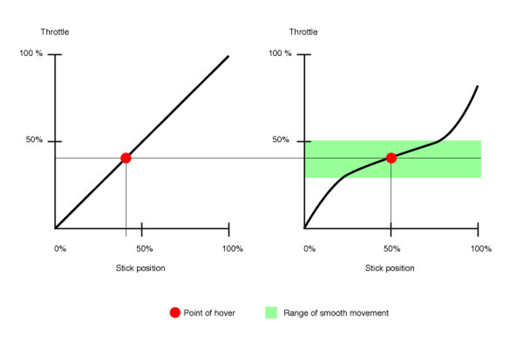
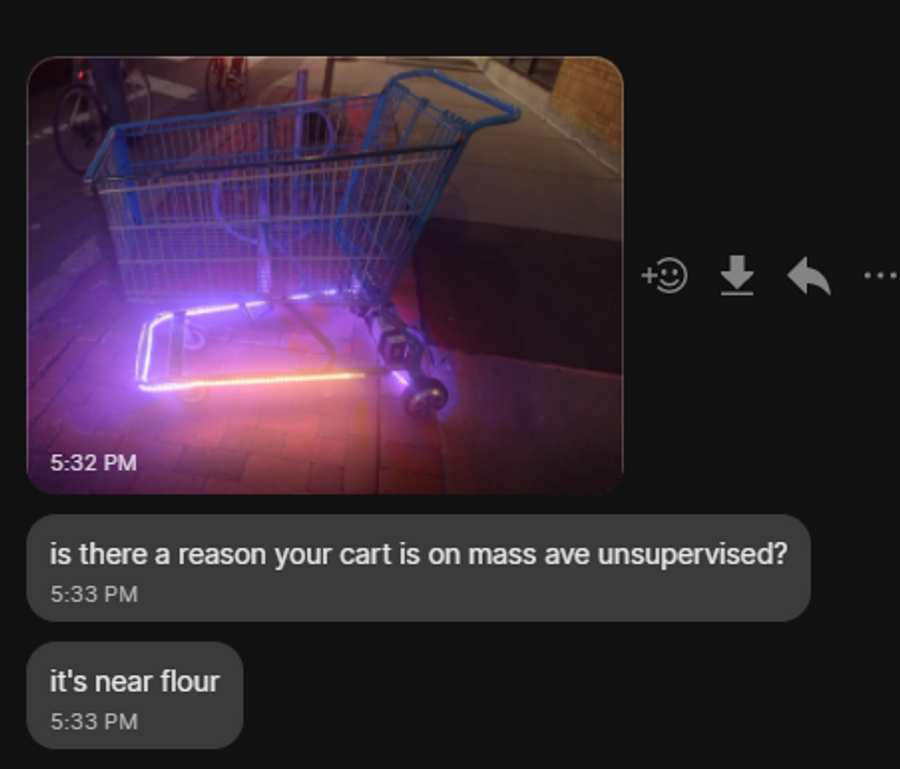

Truthfully, this project was the result of a manic vision manifested through a pile of VESCs over IAP. But the results speak for themselves.

<iframe width="360" height="640"
src="https://www.youtube.com/embed/_9Mg9RTwob0?si=hvTB09PwlBgRaSlo"
title="YouTube video player"
frameborder="0"
allow="accelerometer; autoplay; clipboard-write; encrypted-media; gyroscope; picture-in-picture; web-share"
allowfullscreen></iframe>

## Implementation

Two virtues were prioritized while making this thing - frugality and speed of assembly. This meant that it’s not the *cleanest* design, but it only took a few evenings to build and maybe ~$60 of things I didn’t have lying around.

Torque is provided by two hub motors, left over from the two-wheeled onewheel (link). These are controlled by a pair of VESCs that have their PPM inputs connected to PWM pins on an ESP32. The ESP32 pairs to a PS3 controller over bluetooth, where the forward/backwards motion of each stick controls the torque commanded to each VESC. There’s also a [dead man’s switch](https://en.wikipedia.org/wiki/Dead_man%27s_switch) on the PS3 controller that disengages the motors if both buttons aren’t held down. I did have to reprogram the PS3 controller’s target MAC address with [SixAxisPairTool](https://sixaxispairtool.en.lo4d.com/windows) to get it to the ESP32 though.

The RGB LEDs under the cart are controlled by another ESP32 running [WLED](https://kno.wled.ge/), which is a phenomenally well put-together bit of software that lets me control the LED string over WiFi. MIT has pretty solid coverage over campus, so I can play Spotify on the bluetooth speakers and then use [LedFx](https://ledfx.readthedocs.io/en/master/) to make the LEDs sync to the music!

For those curious the code’s here, there’s nothing too crazy in it:

[https://github.com/FischerMoseley/TheKing](https://github.com/FischerMoseley/TheKing)

As far as the mechanical side of things goes, I took some old pushrod stock from FSAE and cut it about halfway down. This lets the motors slide in, and keeps them colinear so the cart goes in a straight line. In hindsight this stock wasn’t as thick as it should have been (it’s a little bent open now) but it does a pretty good job.

I should also redo the mounts that are welded to the cart - those came with the cart and they’re probably good enough for now, but it’s just a friction fit holding it together. I’d like the safety of the cart to not be dependent on how much preload’s on those bolts, but that’s a problem for later.

I’m kinda proud of where all the parts were sourced from and how cheap everything turned out:

- Shopping cart - free (inherited from an old sim while cleaning out the simmons woodshop)
- Hub motors - free (left over from swapping the motor on the two-wheeled onewheel)
- VESCs - free (left over after making the Pixar Lamp use a single ODrive)
- Two 6S 20Ah LiPos- found on the side of the road (thanks miters@!!)
- 6m WS2812 LEDs - $50
- Two NodeMCU ESP32s  - $10

- Total cost: only $60 for pure chaos.

## Lessons Learned

- There’s some fine print with using torque control. I just took a bunch of robotics classes (2.74, 6.832, 6.843) that really jive with torque control, and so I configured the VESC to use that first. I noticed that it’s *super* easy to break the tractive limit with these motors, especially since the rubber that comes on those hub wheels is really hard and grinds off easily. After about a week the tires now look like this:
    - I made the throttle curve a little less aggressive - the stick isn’t very sensitive when you barely push it, but after you push it a ways the torque kicks in pretty quick. This diagram explains it pretty well:
    
    (from [http://multicopterworld.com/2011/04/multicopter-throttle-curve/](http://multicopterworld.com/2011/04/multicopter-throttle-curve/))

- The default parameters for PID speed control on the VESC are super garbage, and speed control doesn’t feel that natural anyway. So far torque control with an exponential throttle curve seems to be the best way to approximate a ‘gas pedal’ for each wheel.
- The cart has no emergency stop - and adding one would be pretty nontrivial. There’s no mechanical brakes, so the only way to slow down it to exert negative torque (this is better known as regenerative braking). The standard procedure of using a mushroom switch in series with the batteries as an estop would be problematic - if you push it, you remove your ability to slow down. There’s two ways of fixing this:
    - Adding mechanical brakes. This is really hard to do with hub motors, and I didn’t have the resources to make a better powertrain with the time and parts I had.
    - Make the estop act in software, commanding the motors to brake until the motor stops moving. This absolutely should be done, but requires rewiring the VESCs to accept input over UART so they know when to coast, and when to brake. I haven’t found a good library that isn’t super old and is compatible with the standard suite of MCUs under the Arduino umbrella.
- VESCs kinda suck. The current control is good enough for electric skateboards and shopping carts, but I don’t think they were commanding anything *close* to the current that they were programmed to. I was able to get the cart moving a bit after after fiddling with the settings, but after building the Pixar Lamp I don’t think the resolution on the onboard shunts is good enough for anything that’s not tractive. Two-channel ODrives are cheaper per-channel and have a nice python/USB interface, I’ll probably be sticking with them for the time being.
- ESP32 modules have a bit of variation amongst types. I used a NodeMCU board, but after trying on a ESP32 from 6.08 we couldn’t get the PS3 controller to connect.
- Sensorless doesn’t work at low speeds, regardless of how many poles your motor has! The hub motors are 12-pole machines (I think) and they’re still obnoxious to get any torque out of at low speed.

## Cute Pictures

